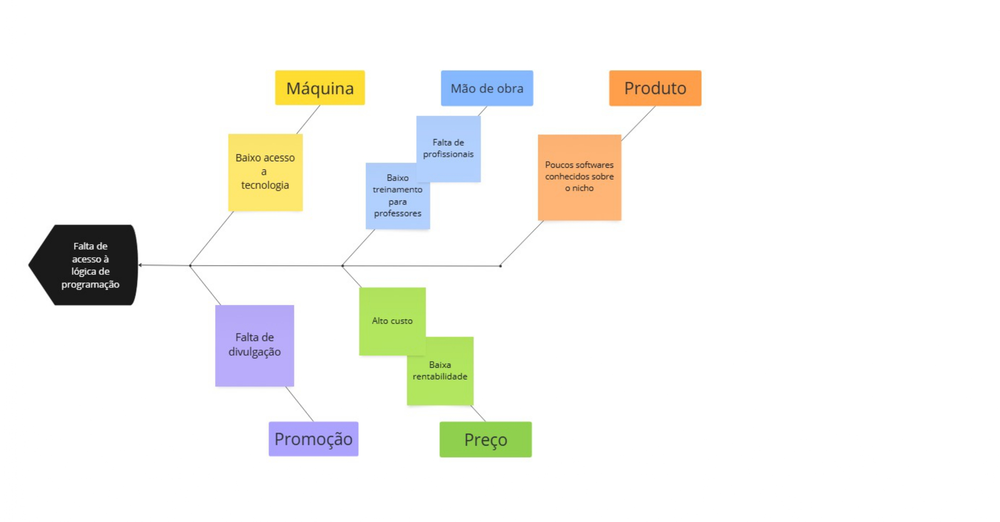

# 1.2. Módulo Artefato Generalista

Focos_2: Artefato Independente de Metodologia (ou seja, generalista).

Entrega Mínima: 1 artefato generalista (ESCOPO: 5W2H; Mapa Mental; Diagrama Causa-Efeito; Rich Picture; Léxico (ou Glossário) ou Planos de Risco, Custo e Tempo).

Apresentação (para a professora) explicando o artefato elaborado, com: (i) rastro claro aos membros participantes (MOSTRAR QUADRO DE PARTICIPAÇÕES & COMMITS); (ii) justificativas & senso crítico sobre o trabalho realizado, e (iii) comentários gerais sobre o trabalho em equipe. Tempo da Apresentação: +/- 5min. Recomendação: Apresentar diretamente via Wiki ou GitPages do Projeto. Baixar os conteúdos com antecedência, evitando problemas de internet no momento de exposição nas Dinâmicas de Avaliação.

A Wiki ou GitPages do Projeto deve conter um tópico dedicado ao Módulo Artefato Generalista, cm 1 artefato que seja independente de metodologia adotada, histórico de versões, referências, e demais detalhamentos gerados pela equipe nesse escopo.
Demais orientações disponíveis nas Diretrizes (vide Aprender3).

## Artefato 5W2H

O artefato 5W2H é uma ferramenta de planejamento estratégico que visa organizar e detalhar ações por meio de sete perguntas-chave: What (O quê?), Why (Por quê?), Where (Onde?), When (Quando?), Who (Quem?), How (Como?) e How Much (Quanto custa?). Assim, temos como objetivo estruturar a proposta de desenvolvimento de uma aplicação web educativa de forma clara e objetiva, facilitando a compreensão das motivações, responsáveis, prazos, métodos e recursos necessários para sua execução.

| Elemento | Descrição |
|----------|-----------|
| **What (O quê?)** | Desenvolver uma aplicação web que simule um jogo gamificado para o ensino de lógica de programação e da linguagem Calango, de forma acessível e inclusiva para o público infantojuvenil. |
| **Why (Por quê?)** | Promover o aprendizado de forma simples, intuitiva e contínua, incentivando o interesse de crianças e adolescentes pela lógica de programação. O objetivo é democratizar o acesso ao conhecimento tecnológico e contribuir para o desenvolvimento de habilidades computacionais desde os primeiros anos escolares. |
| **Where (Onde?)** | A aplicação será disponibilizada em ambiente web, acessível a partir de qualquer navegador, permitindo o uso em diferentes locais, como escolas, residências, bibliotecas, entre outros. |
| **When (Quando?)** | O desenvolvimento terá início em 7 de abril de 2025, com término previsto para o final do mês de julho de 2025. |
| **Who (Quem?)** | A equipe responsável é composta por desenvolvedores voluntários da Universidade de Brasília: Ana Catarina Lopes e Vasconcelos dos Santos, Ana Julia Mendes Santos, André Cláudio Maia da Cunha, Cristiano Borges de Morais, Diogo Rodrigues Barboza, Júlia Rocha Fortunato, Luana Ribeiro Soares, Maria Clara Oleari de Araújo, Maurício Ferreira de Araújo e Victor Hugo Rodrigues Guimarães. |
| **How (Como?)** | A aplicação será construída com arquitetura baseada em front-end (responsável pela interface com o usuário), back-end (responsável pela lógica de negócio) e banco de dados relacional (para armazenamento das informações). O sistema utilizará elementos de gamificação, como recompensas por desempenho, design atrativo voltado ao público-alvo e recursos de acessibilidade para garantir inclusão digital. |
| **How Much (Quanto custa?)** | Serão utilizados recursos gratuitos, como frameworks e bibliotecas de código aberto. Considerando os custos indiretos de infraestrutura e trabalho voluntário dos desenvolvedores, estima-se: – R$ 10,00/hora por desenvolvedor; – R$ 150,00/mês de internet; – R$ 3.000,00 por equipamento. Com base em uma média de 80 horas/mês por 4 meses, o custo estimado por desenvolvedor é de R$ 9.600,00, totalizando aproximadamente R$ 96.000,00 para os dez integrantes da equipe. |

# Diagrama de Caso de uso

O diagrama de causa e efeito, amplamente reconhecido como diagrama de Ishikawa (uma homenagem ao seu criador, Kaoru Ishikawa) ou diagrama de espinha de peixe (devido à sua semelhança visual com o esqueleto de um peixe), constitui uma ferramenta gráfica essencial para a identificação das diversas causas potenciais que podem contribuir para um evento ou problema específico.
 
 

## Glossário 

Este glossário tem como objetivo facilitar a compreensão dos principais termos, reúne definições claras e acessíveis de conceitos técnicos, pedagógicos e de interface, voltados especialmente ao público infantojuvenil. Assim, ele atua como um recurso de apoio, tanto para educadores quanto para estudantes, desenvolvedores e outros interessados na aplicação promovendo maior familiaridade com os elementos presentes no ambiente virtual do jogo.

| Termo                      | Definição                                                                                       |
|---------------------------|-------------------------------------------------------------------------------------------------|
| Gamificação               | Uso de elementos de jogos (como pontuação, níveis e recompensas) em contextos educacionais para aumentar o engajamento e a motivação dos usuários. |
| Programação | Processo de escrever instruções (código) para que um computador ou sistema execute tarefas específicas. No jogo, os conceitos são ensinados de forma lúdica, por meio de blocos, desafios e resolução de problemas. |
| Lógica de Programação     | Conjunto de conceitos e raciocínios utilizados para criar algoritmos que solucionam problemas computacionais. |
| Linguagem Calango         | Linguagem de programação educacional, voltada para o ensino de programação de forma simples por utilizar termos em português. |
| Interface Intuitiva       | Design de interface pensado para facilitar o uso, mesmo por pessoas com pouca ou nenhuma experiência prévia. |
| Inclusão Digital          | Processo de garantir que todas as pessoas, independentemente de suas condições sociais, econômicas ou físicas, tenham acesso e saibam usar tecnologias digitais. |
| Jogo Educativo | Estratégia pedagógica que utiliza jogos como ferramenta de ensino para tornar o processo de aprendizagem mais dinâmico e interessante. |
| Usuário Infantojuvenil    | Crianças e adolescentes, comtempladas dos 6 aos 15 anos, que compõem o público-alvo da aplicação educacional. |
| Missão          | Desafio proposto ao jogador dentro da aplicação, geralmente com objetivos claros e recompensas. |
| Acessibilidade digital | Conjunto de práticas e recursos que garantem que o sistema possa ser usado por pessoas com diferentes necessidades. No projeto, inclui: controle sensorial (sons, cores), linguagem simples, navegação intuitiva, feedback visual adaptável e possibilidade de personalização. |
| Recompensa | Benefício ou prêmio concedido dentro do jogo por realizar uma tarefa ou completar um desafio. |
| Lição | Unidade de aprendizado dentro da aplicação, composta por explicações teóricas e atividades práticas. Pode estar integrada a uma missão ou ser apresentada de forma independente. |
| XP (Pontos de Experiência) | Pontos acumulados conforme o jogador completa lições ou desafios. Representam o progresso e podem desbloquear novos níveis ou conteúdos. |
| Algoritmo                 | Sequência de passos lógicos e finitos usados para resolver um problema ou realizar uma tarefa.  |
| Variável                  | Espaço na memória do computador usado para armazenar valores que podem mudar durante a execução do programa. |
| Comando                   | Instrução que informa ao computador uma ação específica a ser executada.                        |
| Condicional               | Estrutura que permite ao programa tomar decisões com base em determinadas condições.            |
| Laço de Repetição         | Estrutura usada para repetir um bloco de código várias vezes, enquanto uma condição for verdadeira. |
| Debug                     | Processo de identificar e corrigir erros em um programa.                                        |
| Ambiente Virtual          | Espaço digital simulado onde o usuário interage com o conteúdo do jogo.                         |
| Plataforma Web            | Aplicativo ou sistema acessado por meio de navegadores de internet, sem necessidade de instalação. |
| Progressão                | Evolução do usuário dentro do jogo, representada por níveis, conquistas ou novos desafios.       |
| Design Responsivo         | Técnica de desenvolvimento que adapta a interface da aplicação para diferentes tamanhos de tela. |

## Plano de Riscos

O Plano de Riscos é um artefato fundamental no gerenciamento de projetos, pois tem como principal objetivo antecipar e lidar com incertezas que possam comprometer o sucesso do projeto. Ele contempla a identificação, análise e planejamento de respostas a possíveis eventos que representem ameaças. Neste projeto, os riscos serão avaliados com base em dois critérios principais: probabilidade de ocorrência e impacto, ambos classificados em uma escala de 1 (muito baixo) a 5 (muito alto). A aplicação deste plano visa minimizar possíveis prejuízos e assegurar maior controle e eficiência ao longo da execução do projeto.

### Probabilidade
| Probabilidade | Peso |
|---------------|:----:|
|Muito Baixa|1|
|Baixa|2|
|Média|3|
|Alta|4|
|Muito Alta|5|

### Impacto
| Impacto | Descrição | Peso |
|---------|-----------|:----:|
| Muito Baixo | Quase imperceptível para o projeto | 1 |
| Baixo | Pouco impacto para o projeto | 2 |
| Médio | Possui impacto para o projeto, mas é recuperável | 3 |
| Alto | Grande impacto para o projeto | 4 |
| Muito Alto | Impede o prosseguimento do projeto | 5 |

### Prioridade
| P/I | Muito Baixo | Baixo | Médio | Alto | Muito Alto |
|-----|:-----------:|:-----:|:-----:|:----:|:----------:|
| **Muito Baixa** | 1 | 2 | 3 | 4 | 5 |
| **Baixa** | 2 | 4 | 6 | 8 | 10 |
| **Média** | 3 | 6 | 9 | 12 | 15 |
| **Alta** | 4 | 8 | 12 | 16 | 20 |
| **Muito Alta** | 5 | 10 | 15 | 20 | 25 |

### Riscos do Trabalho 1
| Identificador do Risco | Risco | Consequência | Tratamento | Probabilidade | Impacto | Prioridade |
|------------------------|-------|--------------|------------|:-------------:|:-------:|:----------:|
| R01                    | Atraso no cronograma de desenvolvimento | Comprometimento da entrega dentro do prazo previsto, afetando o uso planejado | Acompanhar o progresso com reuniões semanais e redefinir prazos intermediários caso necessário | 3              | 4       | 12 |
| R02                    | Falta de domínio técnico sobre gamificação ou linguagem Calango | Funcionalidades mal implementadas ou inconsistentes com o objetivo educativo do sistema | Realizar capacitações prévias e distribuir as tarefas de acordo com as competências da equipe | 2              | 5       | 10 |
| R03                    | Problemas de conectividade de internet por parte dos desenvolvedores | Interrupções no trabalho colaborativo e nos testes em ambiente online       | Garantir conexão reserva e priorizar uso de ferramentas offline quando possível             | 3              | 3       | 9 |
| R04                    | Equipamento com defeito ou indisponível | Paralisação parcial ou total das atividades de um ou mais membros da equipe | Estimular backups frequentes e ter plano de contingência com equipamentos alternativos (como uso de laboratórios da universidade) | 2              | 4       | 8 |
| R05                    | Dificuldade na implementação de recursos de acessibilidade  | Redução do alcance inclusivo da aplicação e descumprimento de proposta do projeto | Pesquisar diretrizes de acessibilidade desde o início e testar com ferramentas específicas   | 3              | 4       | 12 |
| R06 | Conflitos na equipe devido a divergências técnicas | Atrasos e desmotivação | Retrospectivas para ajustes de processo. | 2 | 3 | 6 |
| R07 | Mudanças nos requisitos do projeto | Retrabalho e desalinhamento | Documentação contínua de requisitos e validação semanal dos requisitos | 3 | 3 | 9 |
| R08 | Falta de tempo dos membros devido a compromissos acadêmicos | Redução da produtividade e atrasos nas entregas | Planejamento realista com margem de tempo e divisão equilibrada das tarefas | 4 | 3 | 12 |
| R09 | Falta de feedback de usuários/testadores | Dificuldade em validar se o sistema atende às necessidades reais | Planejar sessões de testes com o público-alvo e educadores durante o desenvolvimento | 3 | 4 | 12 |

## Mapa Mental
O objetivo do Mapa Mental é conectar e expandir ideias, evidenciando a relação entre suas partes. Esse artefato é composto por diversas cores, formas, símbolos e frases que colaboram para organizar e facilitar a associação das informações. O Mapa Mental desenvolvido para o projeto busca proporcionar uma visão ampla do sistema, destacando seus principais recursos e os artefatos utilizados em sua definição.

### Mapa Mental do Projeto
#### Imagem

 
#### Link
<iframe style="border: 1px solid rgba(0, 0, 0, 0.1);" width="800" height="450" src="https://embed.figma.com/board/Yjhf7tLJbbZJYKJ5isGopm/Mapa-Mental---BrinCalango?node-id=0-1&embed-host=share" allowfullscreen></iframe>

## Custo e Tempo

## 📌 Visão Geral
O **BrinCalango** é um jogo educativo web com foco em **ensinar programação de forma simples e lúdica**, especialmente para **crianças**, incluindo **recursos de acessibilidade** (como leitura por voz e contraste de cores).