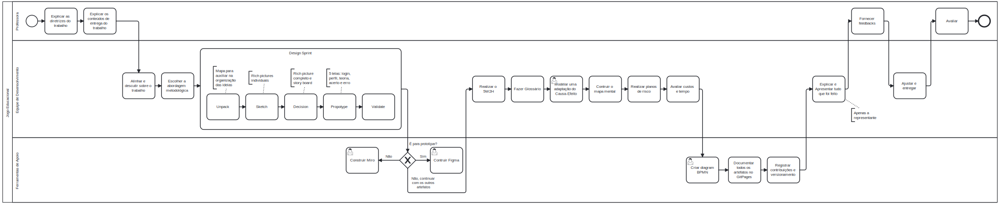
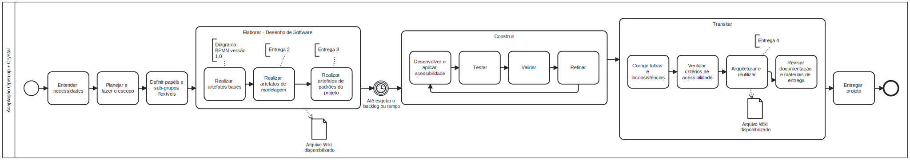

# 1.3. Módulo Modelagem BPMN

O diagrama BPMN (Business Process Model and Notation) descreve de forma clara e organizada o fluxo de um processo de negócio, desde o início até sua conclusão, detalhando as atividades envolvidas, as decisões tomadas e os caminhos possíveis.

### Início do Processo
O processo é iniciado com um evento que representa o ponto de partida das atividades. Este evento de início aciona a primeira tarefa a ser executada no fluxo.

### Atividades (Tarefas)
As tarefas são representadas por retângulos com bordas arredondadas. Cada uma delas simboliza uma ação ou atividade executada por um ator ou sistema. As atividades no processo seguem uma sequência lógica, guiada por conectores de fluxo.

### Gateways (Decisões)
Durante o processo, há gateways do tipo exclusivo (representados por losangos com um “X”) que definem pontos de decisão. Nesses pontos, o fluxo segue apenas um dos caminhos disponíveis com base em uma condição específica.

### Subprocessos ou Tarefas Compostas
Caso o diagrama contenha subprocessos (indicados por um “+” no retângulo da tarefa, ou a representação da tarefa expandida), isso representa atividades mais complexas que podem ser detalhadas.

### Raia (Lanes)
As raias dividem o diagrama por participantes ou áreas envolvidas no processo. Isso facilita a visualização de responsabilidades e atribuições ao longo do fluxo.

### Fim do Processo
O processo termina com um evento de fim (círculo com borda espessa), que representa a conclusão do fluxo.

## Contextualização 

Este diagrama representa o fluxo de trabalho da metodologia do projeto **BrinCalango**, uma aplicação web educacional voltada ao ensino de lógica de programação com foco na acessibilidade e inclusão do público infantojuvenil.

A modelagem segue os padrões da notação BPMN (Business Process Model and Notation) e foi construída a partir de uma adaptação da junção das metodologias **Crystal** e **OpenUP**, adaptadas para a realidade de uma equipe acadêmica com papéis flexíveis e foco na colaboração contínua.

Objetivos: 

- Estruturar o desenvolvimento da aplicação em fases bem definidas (conforme o ciclo do OpenUP: Iniciação, Elaboração, Construção e Transição).
- Garantir flexibilidade e comunicação contínua (valores da metodologia Crystal), considerando que os membros do grupo podem transitar entre atividades conforme a necessidade.
- Incluir tarefas específicas de acessibilidade digital.
- Priorizar a qualidade, iteração contínua e feedback constante, respeitando as limitações, habilidades e realidade do grupo de desenvolvimento.

> Abaixo, segue a versão 1.0 do diagrama BPMN, focado no fluxo de trabalho da entrega 01.

  <em>Figura 1 – Diagrama BPMN Versão 1.0 do processo de desenvolvimento da entrega 01.</em>

 
> Abaixo, segue a versão 2.0 do diagrama BPMN, focado na metodologia.

  <em>Figura 2 – Diagrama BPMN Versão 2.0 do processo de desenvolvimento da metodologia.</em>

## Metodologias Adotadas: Adaptação do OpenUP + Crystal

O projeto **BrinCalango** adota uma **metodologia híbrida e adaptada**, combinando as abordagens **OpenUP (Open Unified Process)** e **Crystal**, a fim de proporcionar um processo de desenvolvimento iterativo, adaptável e colaborativo.

Essa junção permite estruturar o desenvolvimento com base em aspectos fundamentais: boas práticas de engenharia de software, sem abrir mão da simplicidade, flexibilidade e foco nas pessoas.

### Objetivo Geral da Metodologia

Garantir que o processo de desenvolvimento:
- Seja ajustável, a qualquer momento, conforme o contexto e as entregas;
- Incentive a comunicação constante e aberta entre os membros da equipe;
- Promova a colaboração mútua, cada membro tem voz ativa, e respeitando as limitações e habilidades dos integrantes;
- Tenha um refinamento contínuo, após revisão e feedbacks, dos requisitos e funcionalidades;
- Priorize entregas de alta qualidade e foco na arquitetura;
- Permita o entendimento claro da complexidade das tarefas e a sua priorização inteligente;
- Esteja sempre centrado no usuário final, com foco em acessibilidade, inclusão e usabilidade.

### Fases do Ciclo de Vida – BrinCalango

1. **Iniciação**
   - Alinhamento inicial entre os membros da equipe.
   - Definição dos objetivos da aplicação, com ênfase em ensino, acessibilidade e inclusão.
   - Identificação preliminar de riscos, limitações e oportunidades com base nas habilidades da equipe.
   - Formação de subgrupos com funções flexíveis.
   - Organização dos canais de comunicação e definição de ferramentas de apoio ao projeto.

2. **Elaboração**
   - Planejamento das primeiras tarefas do projeto, priorizando requisitos fundamentais.
   - Design inicial da arquitetura da aplicação (divisão entre front-end, back-end e banco de dados).
   - Criação de protótipos acessíveis e lúdicos voltados ao público infantojuvenil.
   - Definição de critérios de qualidade, incluindo diretrizes da WCAG 2.2 e NBR 17225.
   - Estimativas de complexidade e divisão iterativa do escopo.
   - Início do refinamento e revisão colaborativa.

3. **Construção**
   - Implementação contínua por ciclos curtos e interativos.
   - Desenvolvimento em subgrupos colaborativos, com revisões cruzadas entre áreas.
   - Aplicação de testes unitários, testes de usabilidade e acessibilidade sempre que possível.
   - Coleta e análise de feedbacks de usuários reais (alunos e professores).
   - Atualizações de código com base nos feedbacks, priorizando a melhoria contínua.
   - Documentação colaborativa e revisão técnica de cada incremento.

4. **Transição**
   - Finalização dos ajustes de acessibilidade e desempenho.
   - Preparação e entrega da versão estável da aplicação.
   - Treinamento breve de usuários e professores quanto ao uso da plataforma.
   - Coleta de feedback final e planejamento de melhorias para versões futuras.
   - Registro de aprendizados, retrospectiva da equipe e arquivamento de artefatos.

### Justificativa da Escolha

A adaptação da junção do OpenUP com o Crystal foi escolhida por:

- Alinhar estrutura e flexibilidade: o OpenUP traz práticas organizadas de engenharia de software, enquanto o Crystal permite adaptação com base nas pessoas e no projeto, se alinha ao fato de que a equipe é formada por estudantes, com tempo limitado e responsabilidades acadêmica.
- Promover comunicação e colaboração: essencial em uma equipe.
- Permitir entregas frequentes com qualidade, abordagem iterativa que permite validar elementos como usabilidade, linguagem simples, acessibilidade e engajamento infantil, algo necessário para testar o jogo com o público-alvo e aprimorar progressivamente.
- Atender à natureza inclusiva e educacional do BrinCalango.
- Focar na experiência do usuário, principalmente considerando o público com e sem deficiência, o que reforça a importância da interação contínua com os usuários e com a equipe.
- Estrutura útil para decisões, priorização de tarefas e organização das entregas e planejamento.

## Referências

- Ambler, Scott W. "Introduction to the Open Unified Process (OpenUP)". Ambysoft.
- Cockburn, Alistair. "Agile Software Development: The Cooperative Game", 2ª edição, Addison-Wesley, 2006.
- Material didático da disciplina

## Histórico de Versões

| Versão | Data       | Descrição                            | Autor                                                 | Revisor                                               |
| :----: | ---------- | ------------------------------------ | ----------------------------------------------------- | ----------------------------------------------------- |
| `1.0`  | 09/04/2025 | Criação da documentação de Modelagem BPMN       |  [Maria Clara](https://github.com/Oleari19) |
| `2.0`  | 09/04/2025 | Nova metodologia escolhida e de Correção do diagrama BPMN       |  [Maria Clara](https://github.com/Oleari19) |
